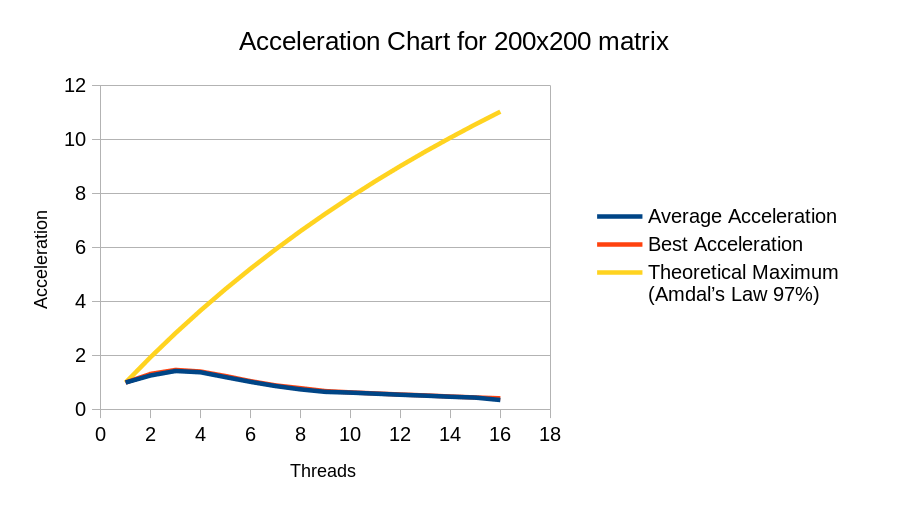

**Отчёт по лабораторной работе №1**


**Студента 1 курса магистратуры, гр. 21.М07-мм**


**Келима Ильи**
_______


## Цель работы
Оптимизировать программу вычисления определителя матрицы, основанную на LU декомпозиции, с помощью OpenMP. 
Проследить зависимость между количеством потоков и ускорением.

## Задачи

- Оптимизировать программу вычисления определителя матрицы, основанную на LU декомпозиции, используя директивы omp parallel из OpenMP.
- Исследовать масштабируемость программы на матрицах 200x200 и 5000x5000.
- Построить зависимость _ускорение:число_потоков_

## Описание программно-аппаратной конфигурации
Выполнение программы производилось под операционной системой Ubuntu 20.04. 
На используемом компьютере установлен процессор `AMD Ryzen 7 5800x` с 8 физическими ядрами 
и 16 логическими ядрами и `64гб` оперативной памяти. 
Компиляция программы производилась с помощью компилятора `gcc 9.3.0`.

## Алгоритм и метод решения
### Исходный алгоритм

Алгоритм поиска определителя матрицы через LU разложение можно разделить на четыре части:
1. Подсчет матрицы перестановок P. (функция mat_pivot)
2. Умножение матрицы A на P. (функция mat_mul)
3. Заполнение матриц U,L. (тройной цикл в функции mat_LU)
4. Подсчет определителя. (цикл в функции calculate_det)

Исходный код LU декомпозиции (первые три шага) был взят [отсюда](http://www.rosettacode.org/wiki/LU_decomposition#C).
Подсчет определителя был реализован по инструкции [отсюда](https://kitchingroup.cheme.cmu.edu/blog/2013/04/01/Computing-determinants-from-matrix-decompositions/).
Подробное описание шагов алгоритма можно прочитать [здесь](http://www.rosettacode.org/wiki/LU_decomposition#:~:text=you%20may%20know.-,Every%20square%20matrix,-%7B%5Cdisplaystyle%20A%7D).


## Метод оптимизации
Алгоритм представляет из себя последовательность шагов, каждый из которых ― это цикл. 
Для оптимизации скорости работы на множестве потоков каждый цикл был покрыт директивой
`#pragma omp parallel for`. Необходимость и конфигурация каждой директивы оптимизировались с помощью
локальных замеров времени для каждого участка кода.


## Измерения
Для тестирования масштабируемости алгоритма были сгенерированы две матрицы размеров 200x200 и 5000x5000. 
На каждой матрице алгоритм запускался на 1-16 потоках и время выполнения считалось с помощью функции `omp_get_wtime`.
Для матрицы 200x200 было произведено 10 итераций подсчетов, для матрицы 5000x5000 ― 5. 
На графиках ниже представлены результаты замеров для среднего и лучшего результатов.
Код и данные в табличном виде представлены в [приложении](#Приложение).


#### График времени работы алгорима в секундах на матрице 200x200 по [таблице](#200-time-table)


#### График ускорения алгорима на матрице 200x200 по [таблице](#200-acceleration-table)


#### График времени работы алгорима в секундах на матрице 5000x5000 по [таблице](#5000-time-table)


#### График ускорения алгорима на матрице 5000x5000 по [таблице](#5000-acceleration-table)


## Выводы
В данной работе проведено исследование масштабирования алгоритма подсчета определителя матрицы с помощью LU декомпозиции.
Произведенные замеры показали, что на матрице размером 200x200 максимальное ускорение достигается на трех потоках.
При дальнейшем увелечении количества потоков производительность начинает падать из-за того, что накладные расходы 
на многопоточность перевешивают выигрыш.
На матрице размером 5000x5000 максимальное ускорение достигается на восьми потоках. На девяти потоках происходит 
резкое падение производительности по сравнению с восьмью. Предположительно, это происходит из-за того, что на компьютере
всего восьемь физических ядер и программе приходится использовать логические ядра для поддержки восьми потоков. При 
дальнейшем увеличении количества потоков ускорение растет, но быстро выходит на плато, как и предсказывает закон Амдала.
# Приложение
## Код
```c
#include <stdio.h>
#include <stdlib.h>
#include <math.h>
#include <omp.h>

typedef double **mat;


void mat_zero(mat x, int n) {
#pragma omp parallel for shared(x)
    for (int i = 0; i < n; i++) for (int j = 0; j < n; j++) x[i][j] = 0;
}


mat mat_new(int n)
{
    mat x = malloc(sizeof(double*) * n);
    x[0] = malloc(sizeof(double) * n * n);

#pragma omp parallel for shared(x)
    for (int i = 0; i < n; i++) x[i] = x[0] + n * i;
    mat_zero(x, n);

    return x;
}

mat load_matrix(char* filename, int matrix_size) {
    mat x = mat_new(matrix_size);
    FILE* f = fopen(filename, "r+");
    for (int i = 0; i < matrix_size; i++) {
        for (int j = 0; j < matrix_size; j++) {
            fscanf(f, "%lf", &(x[i][j]));
        }
    }
    fclose(f);

    return x;
}

void mat_del(mat x) { free(x[0]); free(x); }


mat mat_mul(mat a, mat b, int n)
{
    mat c = mat_new(n);
#pragma omp parallel for shared(c)
    for (int i = 0; i < n; i++)
        for (int j = 0; j < n; j++)
            for (int k = 0; k < n; k++)
                c[i][j] += a[i][k] * b[k][j];
    return c;
}


void mat_pivot(mat a, mat p, int n)
{
#pragma omp parallel for shared(p)
    for (int i = 0; i < n; i++) for (int j = 0; j < n; j++) { p[i][j] = (i == j); }
#pragma omp parallel for shared(a,p)
    for (int i = 0; i < n; i++) {
        int max_j = i;
        for (int j = i; j < n; j++) {
            if (fabs(a[j][i]) > fabs(a[max_j][i])) max_j = j;
        }

        if (max_j != i) {
            for (int k = 0; k < n; k++) {
                {
                    double tmp = p[i][k];
                    p[i][k] = p[max_j][k];
                    p[max_j][k] = tmp;
                };
            }
        }
    }
}

void mat_LU(mat A, mat L, mat U, mat P, int n)
{
    mat_zero(L, n);
    mat_zero(U, n);

    mat_pivot(A, P, n);
    mat Aprime = mat_mul(P, A, n);

    int i, j;
    for (i = 0; i < n; i++){
        for (j = 0; j < n; j++){
            double s;
            if (j <= i) {
                s = 0;
#pragma omp parallel for shared(L,U) reduction(+:s)
                for (int k = 0; k < j; k++) {
                    s+= L[j][k] * U[k][i];
                }
                U[j][i] = Aprime[j][i] - s;
            }
            if (j >= i) {
                s = 0;
#pragma omp parallel for shared(L,U) reduction(+:s)
                for (int k = 0; k < i; k++) {
                    s += L[j][k] * U[k][i];
                }
                L[j][i] = (Aprime[j][i] - s) / U[i][i];
            }
        }
    }
    mat_del(Aprime);
}


void calculate_det(int p, mat A, int n)
    mat L, P, U;

    L = mat_new(n);
    U = mat_new(n);
    P = mat_new(n);

    omp_set_num_threads(p);
    omp_set_nested(1);

    mat_LU(A, L, U, P, n);

    int swaps = 0;
    double L_diag = 1;
    double U_diag = 1;

    int i;
#pragma omp parallel for private(i) reduction(*:L_diag) reduction(*:U_diag) reduction(+:swaps)
    for (i = 0; i < n; i++){
        if (P[i][i] == 0) {
            swaps += 1;
        }
        L_diag *= L[i][i];
        U_diag *= U[i][i];
    }
    printf("%d\t%f\t%f\t%d\n", p, pow(-1.0, swaps)*L_diag*U_diag, omp_get_wtime() - tim, n);
}

int main()
{
    printf("Threads\tDeterminant\tTime\tMatrixSize\n");

    int n;
    n = 200;
    mat B = load_matrix("matrix-200", n);
    for (int i = 0; i < 10; i++) {
        for (int j = 1; j < 17; j++){
            calculate_det(j, B, n);
        }
    }

    n = 5000;
    mat A = load_matrix("matrix-5000", n);
    for (int i = 0; i < 10; i++) {
        for (int j = 1; j < 17; j++){
            calculate_det(j, A, n);
        }
    }
    return 0;
}
```


## Таблицы измерений

#### 200 time table
| Threads/Attempt | 1        | 2        | 3        | 4        | 5        | 6        | 7        | 8        | 9        | 10       | Average   | Best     |
|-----------------|----------|----------|----------|----------|----------|----------|----------|----------|----------|----------|-----------|----------|
| 1               | 0.037988 | 0.03815  | 0.038211 | 0.038249 | 0.03823  | 0.038249 | 0.039132 | 0.038217 | 0.038252 | 0.038715 | 0.0383393 | 0.037988 |
| 2               | 0.029012 | 0.02888  | 0.029077 | 0.035017 | 0.028816 | 0.029038 | 0.029102 | 0.036709 | 0.029266 | 0.029109 | 0.0304026 | 0.028816 |
| 3               | 0.026824 | 0.02719  | 0.02717  | 0.026674 | 0.026915 | 0.025939 | 0.026565 | 0.027314 | 0.026993 | 0.027202 | 0.0268786 | 0.025939 |
| 4               | 0.027899 | 0.028045 | 0.028272 | 0.0281   | 0.027223 | 0.027016 | 0.02742  | 0.02842  | 0.028191 | 0.027526 | 0.0278112 | 0.027016 |
| 5               | 0.032438 | 0.031331 | 0.032224 | 0.032568 | 0.030672 | 0.031421 | 0.03172  | 0.033028 | 0.032984 | 0.0313   | 0.0319686 | 0.030672 |
| 6               | 0.038184 | 0.037199 | 0.036168 | 0.037669 | 0.037237 | 0.037082 | 0.036879 | 0.038436 | 0.038475 | 0.036704 | 0.0374033 | 0.036168 |
| 7               | 0.043821 | 0.043414 | 0.044485 | 0.045462 | 0.043467 | 0.044099 | 0.044844 | 0.044507 | 0.044312 | 0.042539 | 0.044095  | 0.042539 |
| 8               | 0.055522 | 0.051776 | 0.051625 | 0.051905 | 0.051073 | 0.048166 | 0.051681 | 0.052186 | 0.050891 | 0.049042 | 0.0513867 | 0.048166 |
| 9               | 0.058297 | 0.05899  | 0.059154 | 0.057723 | 0.058894 | 0.055841 | 0.062169 | 0.057213 | 0.059218 | 0.058873 | 0.0586372 | 0.055841 |
| 10              | 0.062479 | 0.061719 | 0.059862 | 0.061503 | 0.061258 | 0.060853 | 0.060046 | 0.061198 | 0.062149 | 0.061313 | 0.061238  | 0.059862 |
| 11              | 0.066101 | 0.066213 | 0.064487 | 0.066487 | 0.066432 | 0.064744 | 0.063888 | 0.0653   | 0.065492 | 0.065117 | 0.0654261 | 0.063888 |
| 12              | 0.071104 | 0.07069  | 0.070369 | 0.06894  | 0.070885 | 0.070261 | 0.070133 | 0.068453 | 0.070104 | 0.069776 | 0.0700715 | 0.068453 |
| 13              | 0.076083 | 0.075056 | 0.074101 | 0.074861 | 0.074837 | 0.074351 | 0.072911 | 0.07531  | 0.075442 | 0.07546  | 0.0748412 | 0.072911 |
| 14              | 0.081684 | 0.0829   | 0.078998 | 0.081168 | 0.081542 | 0.080582 | 0.079673 | 0.081433 | 0.081026 | 0.080593 | 0.0809599 | 0.078998 |
| 15              | 0.087218 | 0.088041 | 0.087751 | 0.086805 | 0.086573 | 0.086573 | 0.086932 | 0.085725 | 0.08534  | 0.087056 | 0.0868014 | 0.08534  |
| 16              | 0.093417 | 0.097503 | 0.172543 | 0.091571 | 0.092239 | 0.124277 | 0.119748 | 0.095626 | 0.112144 | 0.094373 | 0.1093441 | 0.091571 |

#### 200 acceleration table
| Threads/Attempt | Average Acceleration | Best Acceleration | Theoretical Maximum (Amdal’s Law 97%) |
|-----------------|----------------------|-------------------|---------------------------------------|
| 1               | 1                    | 1                 | 1                                     |
| 2               | 1.26105333096512     | 1.3182953914492   | 1.94174757281553                      |
| 3               | 1.42638753506507     | 1.46451289563977  | 2.83018867924528                      |
| 4               | 1.37855612127488     | 1.40612970091797  | 3.6697247706422                       |
| 5               | 1.19927991841995     | 1.23852373500261  | 4.46428571428571                      |
| 6               | 1.02502452992116     | 1.05032072550321  | 5.21739130434783                      |
| 7               | 0.869470461503572    | 0.893015820776229 | 5.93220338983051                      |
| 8               | 0.746093833618427    | 0.788689116804385 | 6.61157024793388                      |
| 9               | 0.653839201053256    | 0.680288676778711 | 7.25806451612903                      |
| 10              | 0.626070413795356    | 0.634592896996425 | 7.87401574803149                      |
| 11              | 0.585993968767816    | 0.594603055346857 | 8.46153846153846                      |
| 12              | 0.547145415753908    | 0.554950111755511 | 9.02255639097744                      |
| 13              | 0.512275324286623    | 0.521018776316331 | 9.55882352941176                      |
| 14              | 0.473559132360588    | 0.480872933491987 | 10.0719424460432                      |
| 15              | 0.441689880577963    | 0.445137098664167 | 10.5633802816901                      |
| 16              | 0.350629800784862    | 0.414847495386094 | 11.0344827586207                      |

#### 5000 time table
| Threads/Attempt | 1         | 2         | 3          | 4          | 5          | Average     | Best       |
|-----------------|-----------|-----------|------------|------------|------------|-------------|------------|
| 1               | 618.25033 | 608.70459 | 633.073092 | 619.25033  | 609.70459  | 617.7965864 | 608.70459  |
| 2               | 302.98035 | 302.11996 | 302.015361 | 303.98035  | 303.11996  | 302.8431962 | 302.015361 |
| 3               | 207.24611 | 207.4974  | 207.126575 | 208.24611  | 208.4974   | 207.722719  | 207.126575 |
| 4               | 161.19013 | 160.96408 | 160.822052 | 162.19013  | 161.96408  | 161.4260944 | 160.822052 |
| 5               | 134.28617 | 135.73686 | 133.790501 | 135.28617  | 136.73686  | 135.1673122 | 133.790501 |
| 6               | 116.6451  | 116.37116 | 116.141622 | 117.6451   | 117.37116  | 116.8348284 | 116.141622 |
| 7               | 104.74294 | 105.62903 | 104.922833 | 104.74294  | 105.74294  | 105.1561366 | 104.74294  |
| 8               | 97.463427 | 96.418227 | 94.7448    | 98.463427  | 97.418227  | 96.9016216  | 94.7448    |
| 9               | 110.80804 | 104.63921 | 110.943265 | 111.80804  | 105.63921  | 108.767553  | 104.63921  |
| 10              | 101.87764 | 104.85428 | 104.772583 | 102.87764  | 105.85428  | 104.0472846 | 101.87764  |
| 11              | 101.16823 | 102.2892  | 101.17062  | 102.16823  | 103.2892   | 102.017096  | 101.16823  |
| 12              | 100.11925 | 99.248538 | 100.811873 | 101.11925  | 100.248538 | 100.3094898 | 99.248538  |
| 13              | 99.724576 | 99.23807  | 100.466451 | 100.724576 | 100.29807  | 100.0903486 | 99.23807   |
| 14              | 96.83269  | 99.29807  | 101.549688 | 97.83269   | 100.29807  | 99.1622416  | 96.83269   |
| 15              | 97.705846 | 97.54655  | 100.869495 | 98.705846  | 98.54655   | 98.6748574  | 97.54655   |
| 16              | 96.868945 | 100.19793 | 105.389496 | 97.868945  | 101.19793  | 100.3046492 | 96.868945  |

#### 5000 acceleration table
| Threads/Attempt | Average Acceleration | Best Acceleration | Theoretical Maximum (Amdal’s Law 97%) |
|-----------------|----------------------|-------------------|---------------------------------------|
| 1               | 1                    | 1                 | 1                                     |
| 2               | 2.03998833109661     | 2.01547559695151  | 1.94174757281553                      |
| 3               | 2.97414066874409     | 2.93880488295623  | 2.83018867924528                      |
| 4               | 3.82711722473538     | 3.7849572395706   | 3.6697247706422                       |
| 5               | 4.57060643098295     | 4.54968465960076  | 4.46428571428571                      |
| 6               | 5.28777758191153     | 5.24105466686181  | 5.21739130434783                      |
| 7               | 5.87504073823115     | 5.81141401988525  | 5.93220338983051                      |
| 8               | 6.37550307414051     | 6.42467544392938  | 6.61157024793388                      |
| 9               | 5.67997136425419     | 5.81717493853404  | 7.25806451612903                      |
| 10              | 5.9376521816505      | 5.97485954719799  | 7.87401574803149                      |
| 11              | 6.05581427646206     | 6.01675634732366  | 8.46153846153846                      |
| 12              | 6.15890468221682     | 6.13313407195983  | 9.02255639097744                      |
| 13              | 6.17238919677416     | 6.13378101770823  | 9.55882352941176                      |
| 14              | 6.23015954895477     | 6.28614768421697  | 10.0719424460432                      |
| 15              | 6.26093214298377     | 6.24014473090027  | 10.5633802816901                      |
| 16              | 6.15920190467104     | 6.2837949768112   | 11.0344827586207                      |